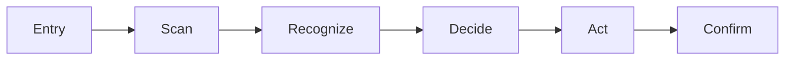

# Design artifacts

## Graph (required on every brief)

Produce a mermaid diagram of the **user’s approach**:

Rename nodes to the concrete job (for example `openSettings` → `findTheme` →
`toggleDark`). Keep node IDs camelCase or underscored; no spaces in IDs.

Optional second graph: primary / secondary / tertiary hierarchy only — do not
draw a full component tree.

## Picture (literal wireframe)

When the brief changes layout, hierarchy, or the primary action, generate a
**literal picture** with Cursor `GenerateImage`:

| Viewport | Aspect |
|---|---|
| Mobile | `9:16` |
| Desktop | `16:9` |
| Square / icon-like crop | `1:1` only if the surface is square |

### Prompt bar

- Wireframe or low-fidelity UI mock — not a polished marketing render
- Name the **primary action** label in the prompt
- Number the **eye path** (1 → 2 → 3) on the frame when hierarchy matters
- Neutral UI chrome; avoid decorative gradients and fake brand polish unless the
  project brand is the subject

### Before / after

When changing an existing screen:

1. Generate or obtain a **before** frame (screenshot as `reference_image_paths`
   when available).
2. Generate the **after** frame with the same viewport and chrome.
3. Keep both in the brief so the change is visible.

### States as pictures

When the change *is* a state (empty, error, pressed), generate that state frame
in addition to (or instead of) the happy path.

## Skip pictures

Skip `GenerateImage` when **all** of:

- Copy-only, token-only, or a bug fix that does **not** move layout, hierarchy,
  or the primary action

Still write the one-line **reason** for the change. Graph may be omitted only
when the approach path is unchanged and the task is not a design plan.

## Tool policy

Pictures are part of **this skill’s deliverable**. Calling `GenerateImage` for a
design brief the user asked for is required work — not an optional illustration
tacked onto a code refactor. Do not generate pictures for unrelated refactors
that never entered this process.
