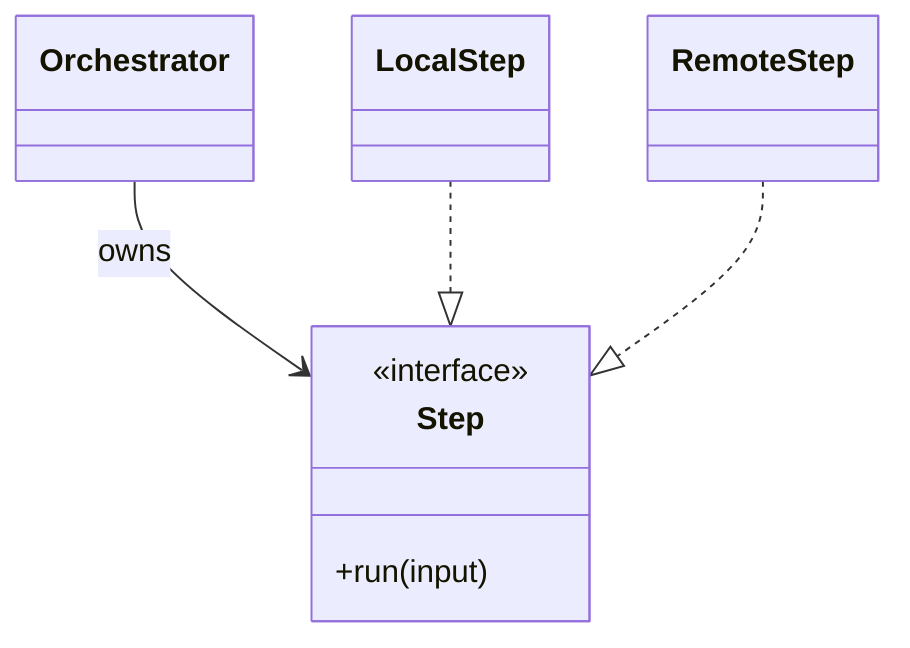
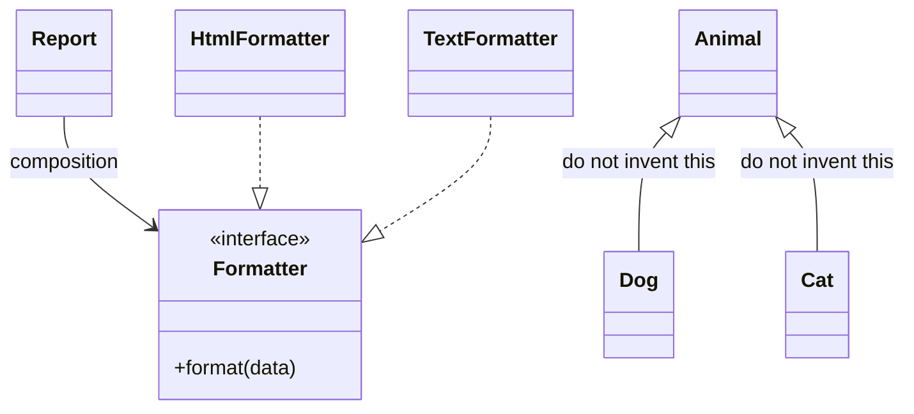
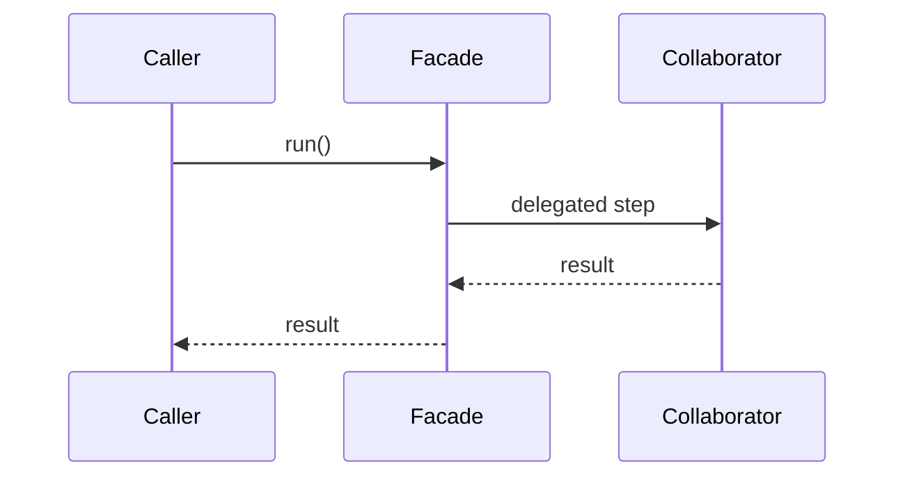

# OOP and patterns

Language-agnostic. Load this when choosing how to structure behavior. A language skill owns the syntax (`Protocol`, interfaces, abstract classes).

Enforce an **interface** when a **second real variant** of the same concern exists. One implementation stays a concrete type or a function. Coupling rules for premature abstraction live in `references/coupling-decoupling.md`. The four concerns (data, orchestration, presentation, I/O) live in `references/separation-of-concerns.md`.

## What OOP is

An object hides state and exposes behavior. Callers use the behavior. They do not reach into the object's fields.

Use an object when there is state to protect or a behavior you will swap. Use a plain function when the operation has no state and only one implementation.

## When a function beats an object

A pure function returns a new value from its arguments. It does not mutate inputs, read hidden fields, or perform I/O. Put mutation and I/O in a thin outer layer. Pass values into pure transforms and commit the result at the edge. Shared mutable object graphs are a poor model for concurrent work.

Immutability is the default where allocation is cheap. Update in place on a measured hot path where allocation dominates. Layout for that path lives in the performance skill's `references/data-layout.md` when that skill is installed.

## The Expression Problem

A design is easy to extend on one axis. Pick that axis before adding types or operations.

| Axis that will keep growing | Shape | Cost of the other axis |
|---|---|---|
| New data types | A new implementor of an existing interface | A new operation touches every type |
| New operations | A function over a closed set of data | A new type touches every function |

- **Enforce** the open axis in a module comment so the next edit does not reopen the other one.
- **Do not** add a Visitor, a type class, or a parallel hierarchy for a single new case. Those mechanisms pay off when both axes are already growing.

## Interface vs implementation

The **interface** is the contract: method names, inputs, and results. The **implementation** is one concrete type that fulfills it.

- **Enforce** when callers must keep working as implementations change, or when a second variant appears.
- **Do not** invent a contract for a single concrete type. Call that type directly.

## Composition over inheritance

Composition builds behavior by owning collaborators. Inheritance is for a true subtype: the child honors every promise of the parent and can replace it.

- **Enforce** composition when you are combining jobs (format + clock + storage).
- **Do not** grow a base class so each new case can override one method. That hierarchy is a strategy interface written as inheritance.

## Delegation

The owner holds a collaborator and forwards one job to it. The owner stays responsible for the outcome. The collaborator does the job.

- **Enforce** when a class is doing work that has its own reason to change.
- **Do not** forward every call through an empty wrapper. That is a pass-through, not delegation.

## Orchestration

The orchestrator decides order, passes results forward, and handles failure. It does not implement the steps.

- **Enforce** when one module both sequences steps and contains a step's logic. Move the step out.
- **Do not** call a single function an orchestrator. Orchestration starts when there are steps to sequence.

## Facade

One entry type hides a set of collaborators. Callers talk to the facade. They do not assemble the collaborators themselves.

- **Enforce** when callers otherwise reach across several modules to finish one task.
- **Do not** add a facade over a single type.

## Strategy

Interchangeable behaviors behind one interface. The caller names the job (`publish`, `render`). It does not name the variant.

- **Enforce** when a second variant of the same job appears (a second exporter, a second notifier, a second store).
- **Do not** use a strategy for one behavior, or for variants that change for different reasons. Those stay separate types.

## Factory

One function reads the environment or configuration and returns the implementation. Call sites take the interface back. They do not branch on type, host, or feature flag.

- **Enforce** when more than one call site would otherwise repeat the same selection.
- **Do not** hide a single constructor behind a factory that always returns the same type.

## Adapter

An adapter translates a foreign API into the interface the rest of the program uses. The translation sits at the edge.

- **Enforce** when a third-party or host type would otherwise spread through core modules.
- **Do not** adapt your own types to themselves.

## Dependency direction

Core depends on the interface. Concrete modules depend on that interface and on shared data types. They do not import the core that owns the flow, and core does not import a concrete module.

Collaborators use the public contract. If a collaborator needs a behavior, put that behavior on the interface. Do not read another object's private fields.

- **Enforce** when two modules import each other, or when a caller branches on a concrete type.
- **Do not** invert a dependency that only one concrete type will ever satisfy.
